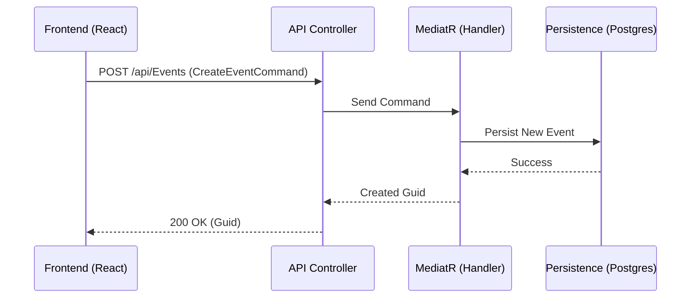

# Referencia de API y Comandos - Attenda

La comunicación entre el Frontend y el Backend se realiza mediante una API RESTful que implementa el patrón **CQRS**. Las solicitudes de escritura se gestionan mediante **Comandos** procesados por MediatR.

## Flujo de un Comando



## Endpoints de Eventos (`EventsController`)

| Método | Endpoint | Descripción | Comando / Query |
| :--- | :--- | :--- | :--- |
| **POST** | `/api/Events` | Crea un nuevo evento. | `CreateEventCommand` |
| **GET** | `/api/Events` | Obtiene los eventos del usuario. | `GetMyEventsQuery` (Pendiente) |

### Detalle: CreateEventCommand
Estructura de la petición para crear un evento:
```json
{
  "name": "Boda de Ana y Luis",
  "description": "Nuestra gran celebración",
  "startDate": "2026-12-25T18:00:00Z",
  "endDate": "2026-12-25T23:59:59Z",
  "organizerId": "uuid-del-usuario"
}
```

## Seguridad y Autenticación
- **JWT**: Todos los endpoints (excepto Login/Registro) requieren un token Bearer en la cabecera `Authorization`.
- **Integración Supabase**: El backend valida el JWT emitido por la instancia de Supabase del proyecto.

---
*Para ver cómo el Frontend consume esta API, consulta [FRONTEND_GUIDE.md](./FRONTEND_GUIDE.md).*
