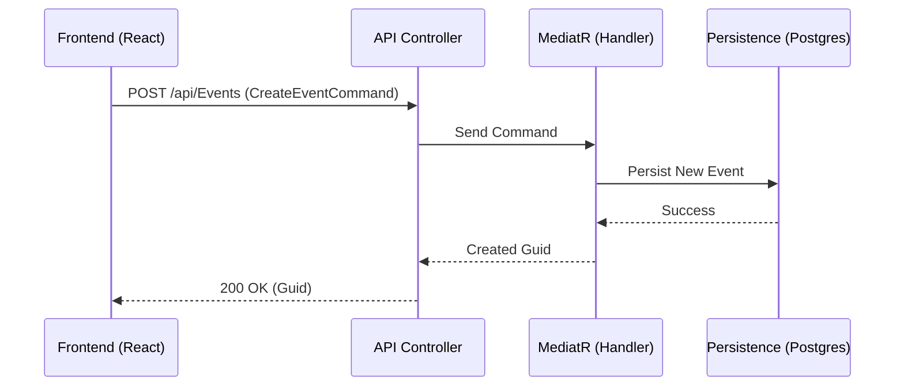

# API Reference & Commands - Attenda

Communication between the Frontend and Backend is handled via a RESTful API implementing the **CQRS** pattern. Write operations are managed by **Commands** processed through MediatR.

## Command Flow



## Event Endpoints (`EventsController`)

| Method | Endpoint | Description | Command / Query |
| :--- | :--- | :--- | :--- |
| **POST** | `/api/Events` | Creates a new event. | `CreateEventCommand` |
| **GET** | `/api/Events/dashboard/{id?}` | Combined metrics and metadata. | `GetEventDashboardQuery` |

### Detail: EventDashboardDto
Unified response for the statistics dashboard:
```json
{
  "id": "uuid",
  "name": "Boda Ana y Luis",
  "startDate": "2026-12-25...",
  "totalGuests": 150,
  "confirmedGuests": 45,
  "pendingGuests": 90,
  "declinedGuests": 15,
  "progressPercentage": 35
}
```

## Guest Endpoints (`GuestsController`)

Batch management of guest lists linked to specific events.

| Method | Endpoint | Description | Command / Query |
| :--- | :--- | :--- | :--- |
| **GET** | `/api/Guests/event/{eventId}` | List all guests for an event. | `GetGuestsQuery` |
| **GET** | `/api/Guests/groups/{eventId}` | List guest groups for an event. | `GetGuestGroupsQuery` |
| **POST** | `/api/Guests/import` | Bulk import guests via JSON/CSV data. | `ImportGuestsCommand` |
| **DELETE** | `/api/Guests/batch` | Deletes selected guests. | `DeleteGuestsCommand` |
| **DELETE** | `/api/Guests/event/{eventId}/all`| Clears the entire list. | `DeleteAllGuestsCommand` |

## Security & Auth
- **JWT**: All endpoints (except public trackers) require a Bearer token in the `Authorization` header.
- **Authority**: The backend validates tokens against the Supabase OIDC provider at `{project_url}/auth/v1`.
- **Ownership**: The system verifies that the `organizer_id` matches the authenticated `NameIdentifier` (from JWT `sub`).

---
*For frontend integration details, see [FRONTEND_GUIDE.md](./FRONTEND_GUIDE.md).*
