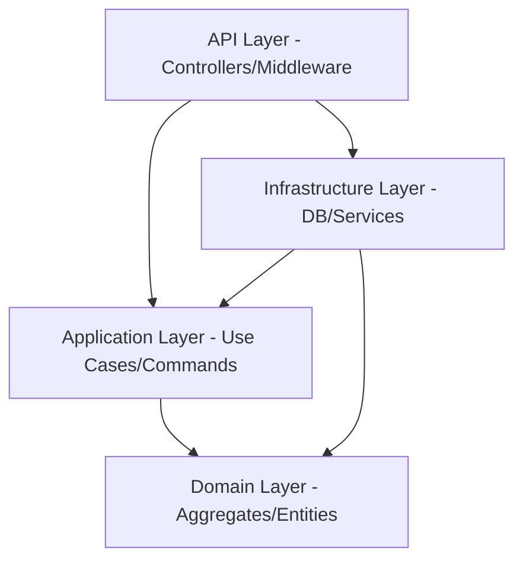

# Arquitectura del Sistema - Attenda

La solución Attenda está construida siguiendo los principios de **Clean Architecture**, lo que permite una separación clara de responsabilidades y facilita las pruebas automatizadas y el mantenimiento a largo plazo.

## Resumen de Capas

### 1. Domain Layer (`Attenda.Domain`)
La capa central y más importante. No tiene dependencias externas.
- **Agregados**: `User` y `Event`.
- **Entidades**: `Guest`, `TaskItem`, `CheckIn`.
- **Value Objects**: `EmailAddress`, `RsvpToken`, `DietaryRestriction`.
- **Interfaces**: Definición de repositorios (`IEventRepository`, `IUserRepository`).

### 2. Application Layer (`Attenda.Application`)
Contiene la lógica de negocio de los casos de uso.
- **CQRS**: Implementado mediante **MediatR**. Separa las operaciones de lectura (Queries) de las de escritura (Commands).
- **Validación**: Uso de **FluentValidation** para asegurar la integridad de los datos antes de procesarlos.
- **Mapeo**: **AutoMapper** para convertir entre Entidades y DTOs.

### 3. Infrastructure Layer (`Attenda.Infrastructure`)
Implementaciones concretas de las interfaces del dominio.
- **Persistencia**: **Entity Framework Core** configurado para **PostgreSQL** (compatible con Supabase).
- **Servicios Externos**: Generación de códigos QR (`QrCodeService`) y manejo de tokens JWT.

### 4. API Layer (`Attenda.API`)
El punto de entrada de la aplicación.
- **Controladores**: Exponen los endpoints REST.
- **Middleware**: Manejo global de excepciones y autenticación.
- **Documentación**: Explotación automatizada mediante **Swagger**.

## Flujo de Datos Típico

1. El Cliente (Frontend) envía una petición HTTP a un **Controlador**.
2. El Controlador mapea la petición a un **Command** (ej: `CreateEventCommand`).
3. **MediatR** intercepta el comando, ejecuta los **Behaviors** de validación y lo envía al **Handler** correspondiente.
4. El Handler utiliza los **Repositorios** para persistir cambios en la Base de Datos.
5. Se devuelven los resultados al cliente a través de **DTOs**.

---
*Para detalles sobre los modelos de datos, consulta [DOMAIN_MODELS.md](./DOMAIN_MODELS.md).*
