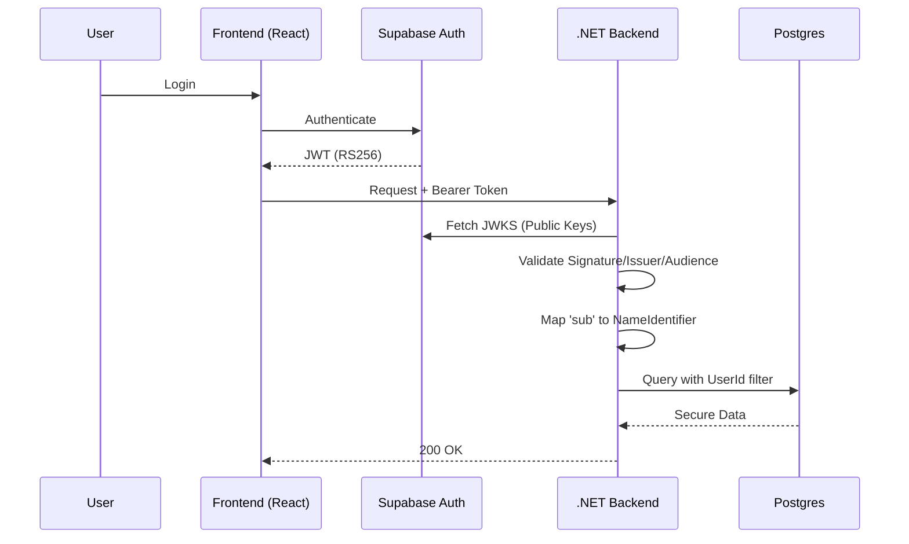

# Authentication Architecture: Supabase & .NET

This document explains how Attenda handles user identity across the stack, ensuring secure data access and owner verification.

## Identity Flow

Attenda uses a "Backend-as-a-Proxy" (or Backend-First) security model. The frontend authenticates with Supabase, but the data access is authorized by the .NET API.



## Implementation Details

### 1. Token Validation (Program.cs)
The backend is configured as an **OIDC Resource Server**. It uses the `Authority` field to point to Supabase's auth endpoint. 
- **Algorithm**: RS256 (Asymmetric).
- **Discovery**: The middleware automatically fetches the `/.well-known/jwks.json` from Supabase to verify signatures, making it resilient to key rotations.
- **Audience**: Validated as `authenticated`, which is the default for Supabase-generated tokens.

### 2. Identity Abstraction (ICurrentUserService)
To prevent the application logic from becoming coupled to HTTP context or specific JWT claims, we use the `ICurrentUserService` interface.

```csharp
public interface ICurrentUserService
{
    string? UserId { get; }      // Maps to Supabase 'sub'
    bool IsAuthenticated { get; }
}
```

This service is implemented in the Infrastructure layer and injected into CQRS Handlers. It extracts the `ClaimTypes.NameIdentifier` populated by the JWT middleware.

### 3. Data Ownership (RLS & Application Level)
While Supabase has Row Level Security (RLS), Attenda enforces ownership at the **Application Layer**. Handlers explicitly include the `UserId` in their queries (e.g., `.Where(e => e.OrganizerId == _currentUserService.UserId)`). This ensures a "Defense in Depth" strategy.

---
*For API endpoint details, see [API_REFERENCE.md](./API_REFERENCE.md)*
