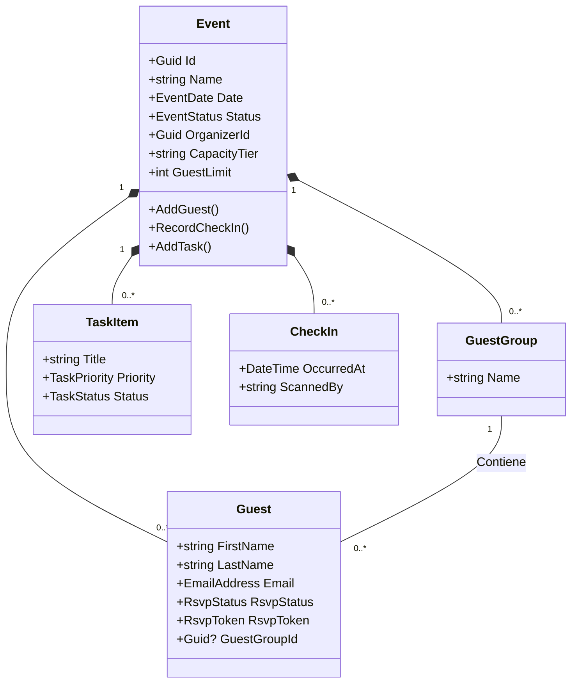

# Modelos de Dominio - Attenda

El dominio de Attenda se organiza en torno a **Agregados**, que son grupos de objetos relacionados que se tratan como una unidad para cambios de datos.

## Diagrama de Clase (Event Aggregate)

## Entidades Principales

### 1. Agregado: Evento (`Event`)
Es la raíz del dominio. Gestiona la configuración del evento, los límites de invitados y coordina las acciones sobre sus entidades hijas.
- **Religioso vs Recepción**: Soporta direcciones separadas y celebrantes.
- **Límites**: El `GuestLimit` se aplica según el `CapacityTier` (ej: FREE limitado a 20 invitados).

### 2. Invitado (`Guest`)
Representa a una persona invitada al evento.
- **RSVP**: Estado de respuesta (`Pending`, `Confirmed`, `Declined`).
- **Token Unique**: Cada invitado tiene un `RsvpToken` para accesos seguros sin login.
- **Grupos**: Puede pertenecer a un `GuestGroup` (ej: "Familia Novia").

### 3. Check-In
Registro histórico de la entrada de un invitado al evento.
- Previene registros duplicados para el mismo invitado.

### 4. Tareas (`TaskItem`)
Lista de pendientes asociados al evento con prioridad y fechas de vencimiento.

## Value Objects (Objetos de Valor)
- **EmailAddress**: Valida el formato del correo.
- **EventDate**: Asegura que el evento sea en una fecha válida.
- **RsvpToken**: Generado automáticamente para cada invitado.

---
*Para ver cómo estos modelos se exponen vía API, consulta [API_REFERENCE.md](./API_REFERENCE.md).*
