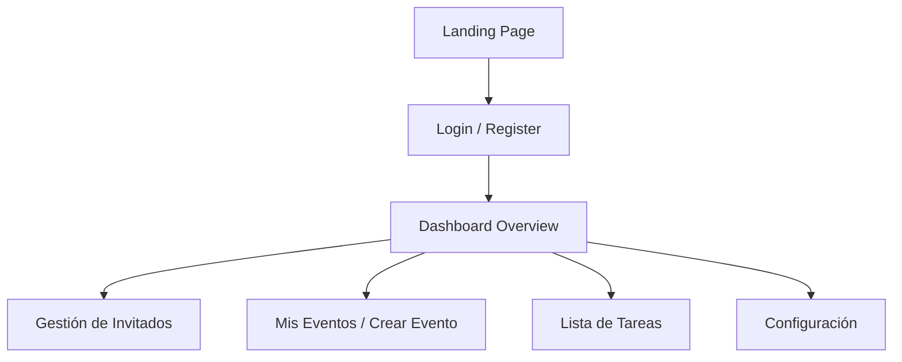

# Guía del Frontend - Attenda

El frontend de Attenda es una aplicación de página única (SPA) construida con **React** y **Vite**, diseñada para ofrecer una experiencia de usuario rápida, fluida y con una estética premium ("Concierge").

## Mapa de Navegación

## Estructura de Archivos (`/src`)

- **`/components`**:
    - **`layout/`**: Contiene `Navbar`, `Footer` y el `MainLayout` para las páginas públicas.
    - **`dashboard/`**: Componentes específicos del panel de control (`Sidebar`, `GuestDrawer`, `DashboardLayout`).
- **`/pages`**:
    - Páginas públicas de marketing (`Landing`, `Pricing`, `AboutUs`).
    - **`dashboard/`**: Vistas protegidas para la gestión de eventos e invitados.
- **`/contexts`**:
    - **`AuthContext.jsx`**: Gestiona el estado de autenticación y la sesión del usuario mediante Supabase.

## Estética y Estilizado
Se utiliza **Tailwind CSS v4** para el diseño:
- **Vidrio (Glassmorphism)**: Paneles con fondos traslúcidos y desenfoque.
- **Micro-interacciones**: Transiciones suaves al navegar entre pestañas del Dashboard.
- **Mobile-First**: Toda la interfaz está optimizada para dispositivos móviles mediante el `MobileBottomNav`.

## Integración con el Backend
- La aplicación se comunica con la API de .NET para las operaciones pesadas de negocio.
- Utiliza la librería de cliente de **Supabase** directamente para la autenticación y, en algunos casos, para la escucha en tiempo real de cambios en la base de datos.

---
*Para detalles sobre la base de datos y los servicios de infraestructura, consulta [INFRASTRUCTURE.md](./INFRASTRUCTURE.md).*
