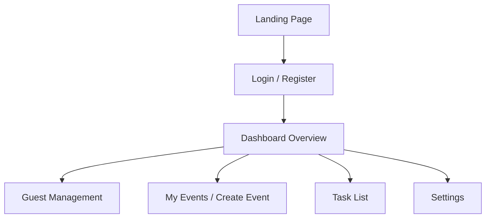

# Frontend Guide - Attenda

The Attenda frontend is a Single Page Application (SPA) built with **React** and **Vite**, designed to provide a fast, fluid, and premium "Concierge" user experience.

## Navigation Map

## Directory Structure (`/src`)

- **`/components`**:
    - **`layout/`**: Contains `Navbar`, `Footer`, and `MainLayout` for public pages.
    - **`dashboard/`**: Dashboard-specific components (`Sidebar`, `GuestDrawer`, `DashboardLayout`).
- **`/pages`**:
    - Public marketing pages (`Landing`, `Pricing`, `AboutUs`).
    - **`dashboard/`**: Protected views for event and guest management.
- **`/lib/api.js`**: **Unified API Client**. Centralized Fetch wrapper that handles Bearer tokens and target URL resolution (`127.0.0.1` for dev stability).
- **`/contexts`**:
    - **`AuthContext.jsx`**: Manages authentication state and user session via Supabase.

## Management Features

### 1. Guest Management (`Guests.jsx`)
The dashboard's flagship view, providing full control over the attendee list.
- **Dynamic Filtering**: Name search and instant filtering by RSVP status and groups.
- **Bulk Actions**: Multi-selection system with an animated toolbar for batch guest deletion.
- **Import/Export**:
    - Pre-configured CSV template download.
    - Direct CSV import with event capacity limit validation.
- **Safety**: The "Clear List" button requires a keyword confirmation ("BORRAR") to prevent accidents.

### 2. Core Dashboard Components
- **`GuestDrawer.jsx`**: Sliding side panel for adding or editing guest details (RSVP, dietary restrictions, notes).
- **`ConfirmationModal.jsx`**: Premium design component for critical actions, supporting loading states and keyword validation.
- **`Sidebar.jsx`**: Persistent side navigation with active states and glassmorphism design.

## Aesthetics & Styling
The application uses **Tailwind CSS v4** for styling:
- **Glassmorphism**: Panels with translucent backgrounds and backdrop blur.
- **Sheen Effect**: Subtle shine micro-animations on interactive containers to accentuate premium elements.
- **Micro-interactions**: Framer Motion is used for smooth modal entries and toolbars.
- **Mobile-First**: Fully optimized for mobile devices through the `MobileBottomNav`.

## Backend Integration
- **Centralized API**: The frontend no longer uses direct Supabase SDK calls for business logic. It maps complex actions to MediatR commands in the .NET API via the `apiClient`.
- **Bearer Authentication**: Authentication headers are automatically injected into backend requests using the Supabase `access_token`.

---
*For details on the database and infrastructure services, see [ARCHITECTURE_AUTH.md](./ARCHITECTURE_AUTH.md).*
