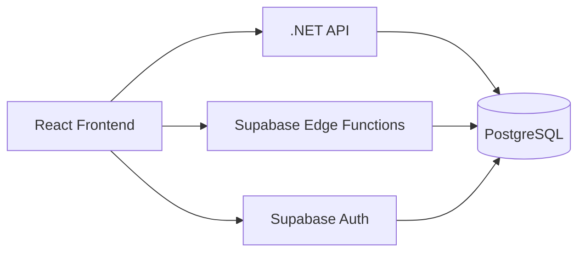

# Infraestructura y Supabase - Attenda

Attenda utiliza una infraestructura híbrida que combina la potencia de un backend **.NET** con los servicios gestionados de **Supabase** para la autenticación, funciones serverless y base de datos en tiempo real.

## Arquitectura de Infraestructura

### 1. Base de Datos (PostgreSQL)
- **Hospedaje**: Gestionado por Supabase.
- **Acceso Híbrido**:
    - El **Backend .NET** accede vía **Entity Framework Core** para la lógica pesada de eventos.
    - Las **Edge Functions** acceden vía el cliente nativo de Supabase para operaciones administrativas rápidas.

### 2. Autenticación (Supabase Auth)
- Proporciona el sistema de registro, login y recuperación de contraseñas.
- Genera tokens **JWT** que el backend .NET valida en cada solicitud protegida.

### 3. Edge Functions (Deno Runtime)
Ubicadas en `/supabase/functions/`. Se encargan de tareas que requieren privilegios de administrador (`Service Role Key`) o que deben ocurrir fuera de la lógica del backend principal.

#### Ejemplo: Funciones Actuales
- **`invite-user`**:
    - **Lógica**: Utiliza el cliente administrativo de Supabase para invitar a un usuario por correo.
    - **Persistencia**: Registra al nuevo miembro en la tabla `team_members` vinculándolo con el ID del propietario (`owner_id`).
    - **Seguridad**: Valida el JWT del usuario que realiza la invitación antes de procesarla.
- **`delete-account` / `deactivate-account`**: Manejan la eliminación segura de datos sensibles del usuario.

## Integración Backend-Supabase
El archivo `appsettings.json` del backend contiene la cadena de conexión a la base de datos de Supabase.
- El backend utiliza el esquema de `snake_case` (estándar en Postgres) configurado en el `AppDbContext` para mapear las clases C# (PascalCase) a las tablas físicas.

---
*Para ver los detalles de los flujos de frontend, consulta [FRONTEND_GUIDE.md](./FRONTEND_GUIDE.md).*
